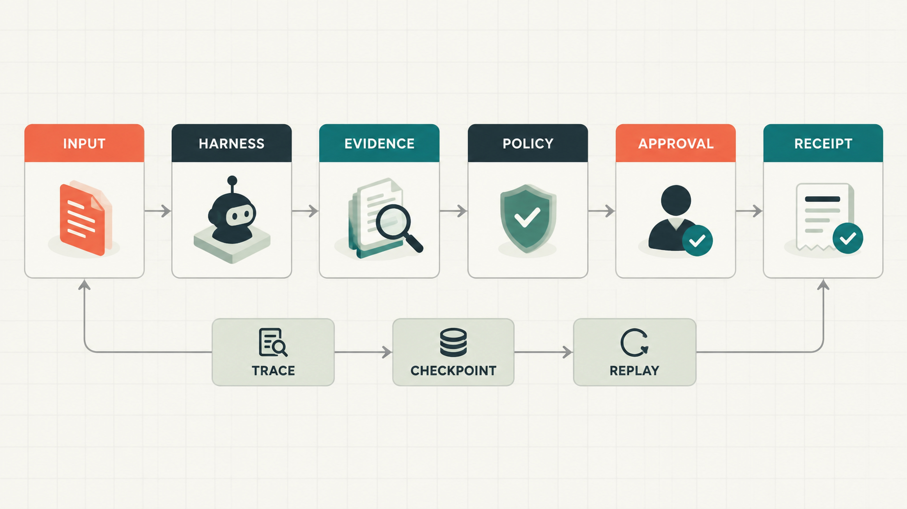

# DevBrief Agent

<p align="center">
  
</p>

<p align="center"><strong>把研发会议中的口语决策，转化为可验证、可审批、可恢复的研发任务。</strong></p>

<p align="center">
  <a href="#快速开始">快速开始</a> ·
  <a href="#能力闭环">能力闭环</a> ·
  <a href="#架构">架构</a> ·
  <a href="CONTRIBUTING.md">参与开发</a>
</p>

<p align="center">
  
</p>

DevBrief 是一个面向研发决策的证据驱动 Agent Harness。它接收版本化、脱敏的 Bug
Triage fixture，经过分析、证据上下文、任务计划、策略和人工审批，生成可审计、可
回放的本地执行结果。运行时以预算、checkpoint、trace、幂等回执和 query-first
恢复为硬边界。

## 当前状态

当前 main 已形成 Phase 1-5 集成版：包含 SQLite 运行记录与重启恢复、真实 GitHub Issues
适配器（含幂等查询）、百炼 ASR/TTS、Vue Web UI、CLI、审批和回执恢复。测试默认使用固定 fixture 与 fake provider，
不需要凭据；GitHub 写入默认 dry-run，只有人工批准且显式配置 token 才会发起真实请求。

真实 GitHub Issue 写入、百炼 ASR/TTS 和本地 Web Demo 已提供最小集成入口；网络超时会保存
`unknown_outcome` 并通过 `/api/recover` 查询；生产鉴权、
实时流式 ASR、队列、多租户和部署仍需独立的 Design/Coding Issue。

## 能力闭环

```text
版本化脱敏 fixture
  -> 输入校验与元数据记录
  -> 单 Agent Harness（状态、预算、取消、checkpoint）
  -> 决策候选与可信上下文
  -> 证据绑定的任务计划与稳定 plan hash
  -> canonical Tool Registry + Policy Gate
  -> 精确、可过期的一次性人工审批
  -> GitHub Issue external-write（写前意图 checkpoint，dry-run 默认）
  -> ToolReceipt、幂等重放、unknown outcome query-first 恢复
```

## 交付内容

| 模块 | 交付能力 |
| --- | --- |
| Harness | 状态机、步骤/工具/模型预算、取消、可恢复失败和安全 checkpoint |
| 输入与分析 | 版本化 fixture 校验、确定性 Bug Triage 候选和脱敏证据引用 |
| Context / Planner | 可信区段隔离、上下文预算、任务草稿、相似项人工复核和稳定 plan hash |
| Tools | canonical registry、read/draft/external 分级、参数校验、Policy 和 dispatch |
| Approval | 精确工具/参数/plan hash、过期检查和一次性消费 |
| Receipts | 幂等键冲突检测、成功回执、未知结果保留和 query-first 恢复 |
| Persistence | SQLite schema migration、运行历史、审批/回执/trace/checkpoint 持久化与重启重建 |
| Trace / Replay | 脱敏事件、状态与工具审计、回放和漂移报告 |

## 架构

<p align="center">
  
</p>

运行时的关键不变量是：不可信的转写、仓库证据和工具结果不能改变策略；external-write
必须经过 Policy、匹配的未过期审批、plan hash、幂等键和写前 checkpoint；provider 返回
未知结果时只能先查询，不能盲目重试。

更完整的生命周期、事件字段和恢复语义见 [Harness Runtime](docs/architecture/harness-runtime.md)
与 [Agent 契约](docs/standards/agent-contracts.md)。

## 快速开始

需要 Python 3.11+。在仓库根目录执行：

```bash
python -m pip install -e ".[dev]"
devbrief run fixtures/transcripts/bug-triage-redacted-v1.json
devbrief serve --port 8000
devbrief approve <session_id> --url http://127.0.0.1:8000
devbrief evidence README.md
devbrief draft plan.json
devbrief eval --check docs/evals/bug-triage-v1-baseline.json
pytest
ruff format --check .
ruff check .
pyright
```

测试只使用固定 fixture 和 fake provider，不需要 API key。ASR/TTS 使用百炼兼容端点：

```bash
set DEVBRIEF_BAILIAN_API_KEY=<your-key>
set DEVBRIEF_BAILIAN_BASE_URL=https://llm-3v3kgqdr8b0jtkjh.cn-beijing.maas.aliyuncs.com/compatible-mode/v1
devbrief transcribe meeting.wav --output transcript.json
devbrief speak "准备提交任务" --output briefing.wav
```

真实 GitHub 写入需要设置 `DEVBRIEF_GITHUB_DRY_RUN=false`、`DEVBRIEF_GITHUB_TOKEN` 和
`DEVBRIEF_GITHUB_REPOSITORY=owner/name`；代码、日志、trace 和 SQLite 都不保存密钥。
若尚未安装 editable package，
可用 `PYTHONPATH=src pytest` 运行测试。

## 文档

- [需求与验收](docs/requirements/需求规格说明.md)
- [系统上下文](docs/architecture/system-context.md)
- [Harness Runtime](docs/architecture/harness-runtime.md)
- [Agent 契约](docs/standards/agent-contracts.md)
- [工程规范](docs/standards/engineering.md)
- [实验记录规范](docs/standards/experiment-records.md)
- [Bug Triage Eval 基线](docs/evals/README.md)
- [ADR 记录](docs/adr/0001-single-agent-harness-first.md)
- [贡献与 PR/Issue 规范](CONTRIBUTING.md)
- [安全报告](SECURITY.md)

## 路线图

- [x] Phase 1：无凭据 Harness、fixture、分析、计划、策略、审批、回执、回放和 fake external-write。
- [x] Phase 2：SQLite、GitHub Issues、仓库范围校验、审批 UI 和任务 draft API。
- [x] Phase 3：真实 GitHub/百炼 provider、dry-run、凭据边界和失败恢复入口。
- [x] Phase 4：版本化 Eval 基线/报告、GitHub Actions CI、可观测 trace/checkpoint 摘要。
- [x] Phase 5：音频上传、ASR 脱敏 fixture、TTS 播放和实时体验实验入口。
- [ ] 后续：生产鉴权、限流、多租户、实时流式 ASR 和更完整的仓库证据索引。

Web API 还提供 `POST /api/evidence`（工作区内有界文本证据）、`POST /api/draft`
（可配置任务系统 draft，默认 dry-run）和 `POST /api/recover`（按幂等键 query-first 恢复未知外部结果）。仓库证据只返回摘要、哈希和 `repo://` 引用，
不会把完整文件内容写入 trace 或数据库。

Web 前端位于 `web/`，使用 Vue 3 + Vite 构建；`devbrief serve` 优先提供提交到包内的
本地构建资源，未构建时回退到内置页面。前端不保存凭据，所有写操作仍由后端审批门禁控制。

## 参与开发

行为变化先建立一个可验收的 Issue，再使用短生命周期分支和对应 PR。PR 必须记录实际
运行的命令、结果、风险和回退方式；安全问题请按 [SECURITY.md](SECURITY.md) 私密报告。
