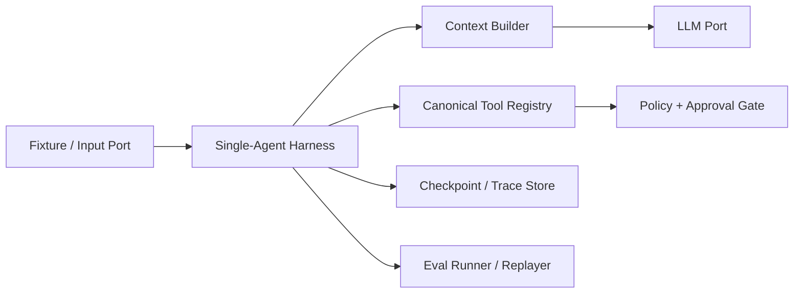

# DevBrief 单 Agent Harness Runtime

**状态：** 本地单 Agent Harness v1 已实现；生产并发、分布式锁和多 Agent 仍为后续设计。

本文件定义 DevBrief 的 Agent 运行时边界。产品不以“一个模型调用成功”作为完成标准，而以任务在预算、权限、失败和恢复约束下可复查地完成为标准。正式事件、工具和审批字段以 [Agent 契约](../standards/agent-contracts.md) 为准。

## 1. 范围

Harness 负责单次研发决策会话的生命周期：接收转写输入、形成候选、检索证据、生成计划、等待审批、受控执行、保存回执、停止或恢复。它不负责模型训练、实时音视频传输、代码执行或多 Agent 调度。



## 2. 生命周期

```text
created -> ingesting -> analyzing -> planning -> awaiting_approval
                                            -> executing -> completed

active state -> cancelled
active state -> failed_recoverable -- resume(checkpoint) --> prior safe state
active state -> failed_terminal
awaiting_approval -> rejected | expired
```

- `ingesting` 首先接收版本化转写 fixture；音频/ASR 后续也必须转成相同的输入事件。
- 每次状态改变、计划变化、审批变化和外部工具结果都生成 trace 事件并尝试写 checkpoint。
- `failed_recoverable` 仅保存已确认安全状态。恢复不能重新调用已有回执的外部写工具。
- `cancelled`、`rejected`、`expired` 和 `failed_terminal` 不会被自然语言或模型输出重新激活；用户必须发起新一轮计划。

## 3. 执行预算和停止条件

每个会话在启动时绑定不可由模型放宽的 `ExecutionBudget`：

| 字段 | 目的 | 耗尽后的行为 |
| --- | --- | --- |
| `max_steps` | 防止循环规划或重复工具调用 | 停止并写入 `budget_exhausted` |
| `max_tool_calls` | 限制外部依赖和攻击面 | 停止后保留 trace 和最后 checkpoint |
| `deadline_at` | 防止长程任务无限悬挂 | 进入可恢复失败，不盲重试 |
| `max_model_tokens` | 限制上下文/生成资源 | 降级为澄清或停止，不截断后继续执行写操作 |
| `max_cost` | 约束 Provider 成本 | 拒绝后续模型调用并给出可审计原因 |

用户取消、Policy 拒绝、审批过期、Schema 校验失败和未知外部写结果也都是停止条件。任何停止都必须记录原因、已执行工具和可用恢复点。

## 4. Checkpoint 与恢复

Checkpoint 是可恢复运行时状态的最小快照，至少引用：会话 ID、状态、预算消耗、计划哈希、审批 ID、已完成工具调用、幂等键、最后事件和 redacted context 引用。

恢复算法必须：

1. 读取最后一个已持久化 checkpoint，验证 Schema 版本和会话所有权。
2. 对每个已发起的外部写先检查 `ToolReceipt` 或用幂等键查询，不允许盲目重放。
3. 只从最后一个**安全状态**继续；输入解析失败可重试，审批失效和未知写入结果不可自动越过。
4. 生成新的 `resume` trace 事件，保留原 trace 作为因果链的一部分。

本项目在 SQLite 本地 Demo 与 PostgreSQL 服务端存储之间保持相同 Repository Port。存储技术不能改变恢复和幂等语义。

## 5. 上下文和工具边界

Context Builder 将系统规则、会话转写、证据和工具结果分为来源明确的区段，并执行预算裁剪。仓库内容、Issue、ADR 和网页均为不可信数据：可以作为引用和模型输入，不能改变 Tool Registry、策略、审批或执行预算。

工具由 canonical registry 声明 Schema、读写等级、执行类别、超时、重试和审计要求。MCP 仅是后续 Adapter 协议之一；它不能绕过 registry、Policy 或 Approval Gate。

## 6. Trace、回放和 Eval

Trace 记录状态迁移、输入/输出摘要、证据引用、工具参数摘要、预算变化、Policy、审批和回执。它不存储 token、原始音频、完整私有转写或未经脱敏的第三方内容。

Replayer 在 fake 环境中按事件顺序重建一次会话，并比较状态、计划哈希、工具决策和回执引用。Eval Runner 以版本化 fixture、标注和模型/提示词版本生成报告；至少覆盖候选字段、证据覆盖、工具选择、政策拒绝、恢复、回放、时延和成本。

## 7. 单 Agent 到多 Agent 的准入条件

在以下证据同时具备前，禁止将多 Agent 作为默认架构：

1. 单 Agent 基线、任务分层和失败类型已通过固定 Eval 集记录。
2. 一个具体瓶颈已被量化，例如上下文窗口、任务分解失败、并行独立检索或端到端延迟。
3. 候选多 Agent 设计有单/多 Agent 对照实验，并报告任务质量、成本、时延、trace 可读性和恢复复杂度。
4. 新 Agent 的权限、记忆边界、消息协议、失败传播和人工审批路径均已进入契约与 ADR。

## 8. 后续实现交接顺序

每个切片先建立独立的 Design/Coding Issue，遵守 `Red -> Green -> Refactor`，并在 PR 记录实际运行的命令和结论。不要把多个切片合并成一个“搭建 Agent 框架”的大 PR。

| 切片 | 首要交付 | 必须验证 | 明确不做 |
| --- | --- | --- | --- |
| 1. 契约与 fixture | JSON Schema/类型、版本化转写 fixture、确定性状态迁移 | 缺字段拒绝、事件顺序、`unknown`/`ambiguous` 字段 | LLM、ASR、GitHub API |
| 2. Harness 核心 | `ExecutionBudget`、状态机、取消、checkpoint Repository Port | step/deadline/cost 耗尽、取消、可恢复和终态限制 | LangGraph 绑定、真实数据库 |
| 3. Trace 与 fake 回放 | 脱敏 TraceSpan、checkpoint 读取、fake Replayer | 回放状态/计划哈希/工具决策一致，且不产生外部副作用 | 真实 Issue 写入 |
| 4. 工具与策略 | canonical registry、假 read/draft/external 工具、Policy Gate | 未批准写拒绝、超 scope 拒绝、预算计数 | MCP 远程接入、任意 shell |
| 5. 决策与证据 | LLM Port、候选 Schema、证据检索 Port、上下文预算 | 无证据降级、提示注入隔离、上下文裁剪记录 | 追求泛化 RAG 或向量库 |
| 6. GitHub 与审批 | GitHub Adapter、Approval、幂等键、ToolReceipt | 过期/篡改批准拒绝、超时查询优先、重放不重复写 | Linear、多仓库、自动代码修改 |
| 7. Eval 与交付 | 标注集、Eval runner、回归报告、OTel、CI/容器 | 指标可复现、失败分类、无凭据 Demo、日志脱敏 | 虚构性能或生产声明 |
| 8. 语音与扩展 | 音频/ASR Port、时延实验；必要时单/多 Agent 对照 | ASR 误差对字段质量的影响、时延/成本、对照结论 | 默认多 Agent 或代码执行 |

切片 1 至 4 完成前，任何 Demo 都必须标记为“Harness 原型”；切片 5 至 7 完成前，不得声称已完成研发决策闭环或已具备生产级可靠性。语音与多 Agent 的工作不允许跳过前置切片。
