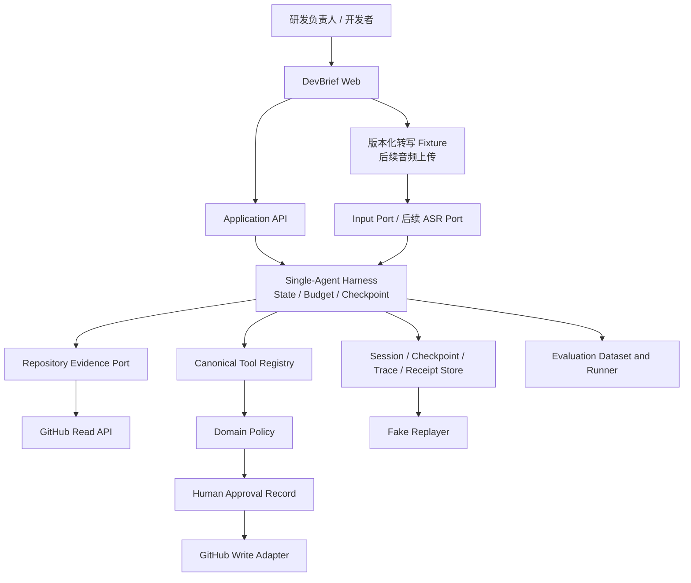
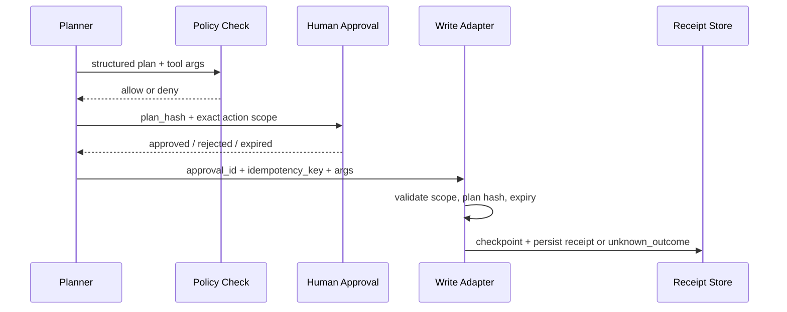

# DevBrief 系统上下文与边界

## 系统上下文

## 责任边界

| 边界 | 负责 | 不负责 |
| --- | --- | --- |
| Web | 导入 fixture、后续采集、显示证据、编辑草稿、批准/拒绝 | 决定写权限、直接调用第三方写 API |
| Application / Harness | 会话生命周期、状态图、预算、checkpoint、恢复、用例 | 存放 provider SDK 类型或领域策略细节 |
| Domain | 决策/审批/工具不变量、策略与错误分类 | HTTP、数据库、WebSocket 和模型 SDK |
| Adapter | 输入/后续 ASR、LLM、GitHub、存储、遥测的协议适配 | 绕过 policy、预算或重新解释领域规则 |
| Eval / Replayer | 固定样本、标注、指标、报告、fake 回放 | 吞掉产品运行时错误、访问真实写 Adapter 或替代测试 |

## 安全写入路径

Harness 的状态、预算、恢复和回放见 [`harness-runtime.md`](harness-runtime.md)。具体事件和状态语义以 [`../standards/agent-contracts.md`](../standards/agent-contracts.md) 为准。跨边界改变前先建立 Design Issue；影响长期方向的决定必须记录 ADR。
